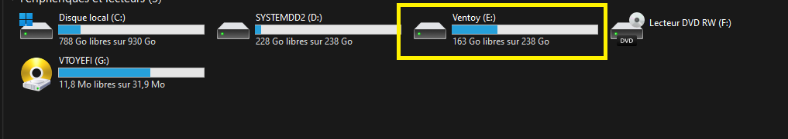
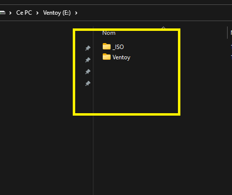

## == Mis en place d'une clées USB Ventoy ==
## Préambule :
Bonjour à tous, tout le monde sait comment créer une clé USB bootable mais là où cela devient intéressant c'est de voir la ribanbel d'application disponible pour le faire. Parmi de nombreux tests effectués, j'ai eu un certain dévouement sur le projet Ventoy qui est Open Source et franchement j'adore, pour ceux qui auraient suivi ma vidéo sur twitch pour savoir comment  créer votre clé USB personnalisé, je vous donne ci-joint ma configuration afin de vous en servir comme modèle.

Liens Videos
------------
    https://casnocensure.site/w/hP1FA4AtfNKAajtHSVUxnM
    https://www.youtube.com/watch?v=YP9FbyIbPgM
    https://www.twitch.tv/roystraque
    https://casagency.fr
    

#### Commencer par télécharger le fichier iso de ventoy :

    https://github.com/ventoy/Ventoy/releases/download/v1.0.70/ventoy-1.0.70-livecd.iso
    

#### Ensuite télécharger l'utilitaire Rufus afin de créer votre clé USB bootable :
    
    https://github.com/pbatard/rufus/releases/download/v3.17/rufus-3.17.exe

#### Si tous ce passe bien, vous devriez pourvoirent retrouvé une partition de votre clé USB nommée "ventoy" :

#### Ensuite télécharger le fichier Ventoy Rar et dézipper le dans la partition "Ventoy", Créer un répartoire "_ISO" qui vous servira à mettre vos isos, vous devriez voir ça :

Pour personalisée ensuite votre thème modifier le fichier "ventoy.json" Voici un exemple :

    {
       "menu_alias":[
          {
             "image":"/_ISO/SERVEUR/2008/SERV2008.iso",
             "alias":"Windows Serveur 2008"
          },
          {
             "image":"/_ISO/SERVEUR/2012/Serveur2012.iso",
             "alias":"Windows Serveur 2012"
          },
          {
             "image":"/_ISO/SERVEUR/2019/Serveur2019.iso",
             "alias":"Windows Serveur 2019"
          },
          {
             "image":"/_ISO/10AIO/WIN10AIO.iso",
             "alias":"Windows 10 AIO V1"
          },
          {
             "image":"/_ISO/10AIO/WINDOWS10.iso",
             "alias":"Windows 10 AIO V2"
          },
          {
             "image":"/_ISO/ARIUM/arium32.iso",
             "alias":"Windows 7 Arium 32bits"
          },
          {
             "image":"/_ISO/ARIUM/arium64.iso",
             "alias":"Windows 7 Arium 64bits"
          },
          {
             "image":"/_ISO/Clonage/acronis14.iso",
             "alias":"Acronis True Image 2014"
          },
          {
             "image":"/_ISO/Clonage/acronis18.iso",
             "alias":"Acronis True Image 2018"
          },
          {
             "image":"/_ISO/Clonage/acronis19.iso",
             "alias":"Acronis True Image 2019"
          },
          {
             "image":"/_ISO/Clonage/acronis21.iso",
             "alias":"Acronis True Image 2021"
          },      
          {
             "image":"/_ISO/Clonage/aoemei.iso",
             "alias":"AOMEI Partition Clonage"
          },
          {
             "image":"/_ISO/Formatage/KillDiskBootDisk.iso",
             "alias":"Formatage bas niveau"
          },
          {
             "image":"/_ISO/Kaisen/kaisenlinuxrolling.iso",
             "alias":"Kaisen Linux Rolling"
          },
          {
             "image":"/_ISO/Kali/kali64.iso",
             "alias":"Kali linux 2020 64bits"
          },
          {
             "image":"/_ISO/Kali/kali86.iso",
             "alias":"Kali linux 2020 32bits"
          },
          {
             "image":"/_ISO/Kali/kaliLive64.iso",
             "alias":"Kali linux 2020 live 64bits"
          },
          {
             "image":"/_ISO/PartitionMagic/pm16.iso",
             "alias":"Partition Magic 2016"
          },
          {
             "image":"/_ISO/PartitionMagic/pm.iso",
             "alias":"Partition Magic 2019"
          },
          {
             "image":"/_ISO/PE/WINPE.iso",
             "alias":"Windows PE"
          },
          {
             "image":"/_ISO/WIN7/W72018.iso",
             "alias":"Windows 7 AIO V1"
          },
          {
             "image":"/_ISO/WIN7/Windows7AIO.iso",
             "alias":"Windows 7 AIO V2"
          },
          {
             "image":"/_ISO/WIN8/WIN864bits.iso",
             "alias":"Windows 8 64bits"
          },
          {
             "image":"/_ISO/Win10/Windows10.iso",
             "alias":"Windows 10"
          },
          {
             "image":"/_ISO/XP/WINXP.iso",
             "alias":"Windows XP"
          },
          {
             "image":"/_ISO/IPFIRE/IPFIRE227.iso",
             "alias":"IPFIRE 2.27"
          },
          {
             "image":"/_ISO/VIRTUEL/PROMOXVE70.iso",
             "alias":"Proxmox VE 7.0"
          },
          {
             "image":"/_ISO/VIRTUEL/PROXMOXMAIL701.iso",
             "alias":"Proxmox Mail Gateway 7.0"
          },
          {
             "image":"/_ISO/VIRTUEL/PROXMOXBACKUPSERVER201.iso",
             "alias":"Proxmox Backup Server 2.0"
          },
          {
             "image":"/_ISO/MENTEST/memtest86.iso",
             "alias":"Mentest 86"
          },
          {
             "image":"/_ISO/WIN11/WIN11.iso",
             "alias":"Windows 11"
          }              
       ],
       "theme":{
          "file":"/ventoy/Themes/honeycomb/theme.txt",
          "gfxmode":"1024x768",
          "display_mode":"GUI",
          "serial_param": "--unit=0 --speed=9600",      
          "ventoy_left":"5%",
          "ventoy_top":"95%",
          "ventoy_color":"#000000"
       },
       "menu_class":[
          {
             "key":"SERV2008",
             "class":"windows"
          },
          {
             "key":"Serveur2012",
             "class":"windows"
          },
          {
             "key":"Serveur2019",
             "class":"windows"
          },
          {
             "key":"WIN10AIO",
             "class":"windows"
          },
          {
             "key":"WINDOWS10",
             "class":"windows"
          },
          {
             "key":"arium32",
             "class":"windows"
          },
          {
             "key":"arium64",
             "class":"windows"
          },
          {
             "key":"acronis14",
             "class":"clone"
          },
          {
             "key":"acronis18",
             "class":"clone"
          },
          {
             "key":"acronis19",
             "class":"clone"
          },
          {
             "key":"acronis21",
             "class":"clone"
          },      
          {
             "key":"aoemei",
             "class":"clone"
          },
          {
             "key":"KillDiskBootDisk",
             "class":"format"
          },
          {
             "key":"kaisenlinuxrolling",
             "class":"gnu-linux"
          },
          {
             "key":"kali64",
             "class":"kali"
          },
          {
             "key":"kali86",
             "class":"kali"
          },
          {
             "key":"kaliLive64",
             "class":"kali"
          },
          {
             "key":"pm16",
             "class":"pmagic"
          },
          {
             "key":"pm",
             "class":"pmagic"
          },
          {
             "key":"WINPE",
             "class":"windows"
          },
          {
             "key":"W72018",
             "class":"windows"
          },
          {
             "key":"Windows7AIO",
             "class":"windows"
          },
          {
             "key":"WIN864bits",
             "class":"windows"
          },
          {
             "key":"Windows10",
             "class":"windows"
          },
          {
             "key":"WIN11",
             "class":"windows"
          },
          {
             "key":"WINXP",
             "class":"windows"
          },
          {
             "key":"IPFIRE227",
             "class":"linux"
          },
          {
             "key":"PROMOXVE70",
             "class":"linux"
          },
          {
             "key":"PROXMOXMAIL701",
             "class":"linux"
          },
          {
             "key":"memtest86",
             "class":"pmagic"
          },
          {
             "key":"PROXMOXBACKUPSERVER201",
             "class":"linux"
          }           
       ]
    }
